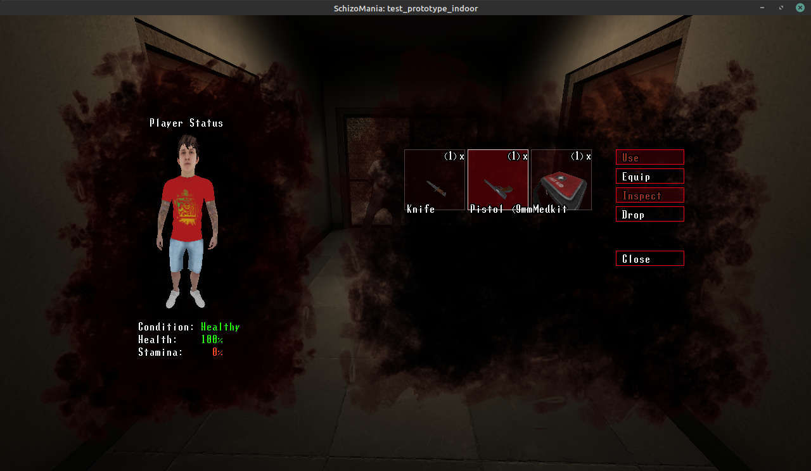

# SchizoMania - Prototype
## Intro:
Welcome to the Git page of SchizoMania, an open-source horror game with inspiration taken from Resident Evil, and Silent Hill, mixed with a touch of FPS.

Currently the game is in early stages of development, after it has had 5 years of ups and downs, iterating its way through various engines. (From 2D, to 3D.)

The gameplay wants to make the player enjoy intense moments where nerves play up, while also having the player do a lot of puzzling and research in its environments. All that, while having the main character combat 2 things: The external world, and to conquer the demons of his own mind.

## Releases:
The game will release new versions from time to time, gradually evolving to a finished product. Currently at the time of writing this document, there is a prototype release codenamed "[The way of the Road](https://github.com/WatIsDeze/SchizoMania-FTE/releases/tag/v0.0.0)" for download.

Let it be clear that since the game is still a prototype, things may change in the future. Also, expect bugs and incomplete features to be there. These releases are not for the weak of heart :)
## Tech:
Using FreeCS and the FTEQW engine, the game has made a huge leap of development progress in 7 months time since it started. With the advantage of having Half-Life based stock entities, mapping becomes quite pleasant and a breeze. Being able to use Worldspawn Editor and its extended VVBSP format, as well as being able to use the extended .iqm format(.vvm) allows for a lot of possibilities, not easily found in other Quake engines.

If you're interested, feel free to get in touch with me. Currently we're a small team of a few people working on this project on/off.

## Screenshots:
Here are some screenshots for those interested to see the first? open-source horror game, inspired by the Resident Evil and Silent Hill series.

> MainMenu

> Intro scene shots of the map: test_prototype_indoor

> HUD Notification after the intro scene, suggesting the player what to do.

> Player searching for the pistol item.

> The status and inventory menu.

> An in-action screenshot of the player combatting a silly AI monster.

